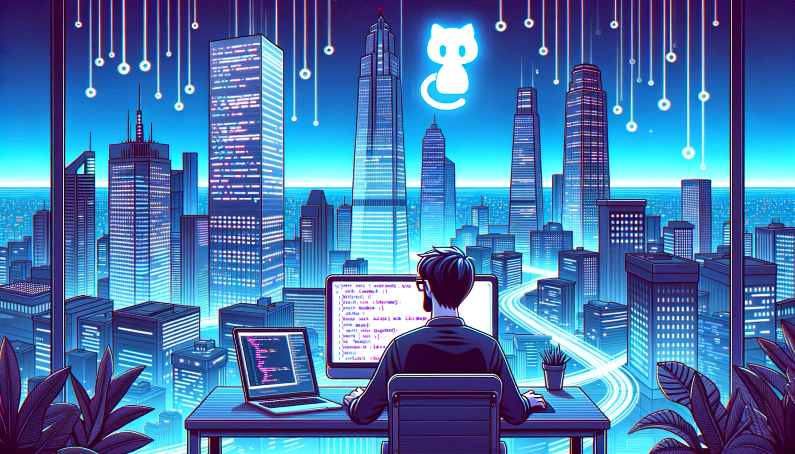

# 💫 About Me:
🎤 **About Me:**  Hi, I’m Tom Daniel! I’m a French student at Epitech University, currently on a journey studying video game development at Keimyung University in South Korea for my 4th year.  🎮 **Current Passion Projects:**  - Developing an Unreal Engine plugin named NPCForge to help indie studios enhance their NPC behavior (Epitech Innovative Project). - Building a RolePlay FiveM server from scratch, focusing on a fully custom experience for players.  🎓 **Currently Enhancing My Skills In:**  - Graphics programming using OpenGL, as part of a game engine design course. - Game server development, particularly for multiplayer game architecture.  🧗 **Hobbies:**  When I’m not coding, you’ll find me bouldering at the climbing gym or enjoying the open road on my motorcycle. Both activities fuel my passion for challenge and adventure.

# 📊 GitHub Stats:
 
 

## 🏆 GitHub Trophies

### 🔝 Top Contributed Repo

<!-- Proudly created with GPRM ( https://gprm.itsvg.in ) -->
